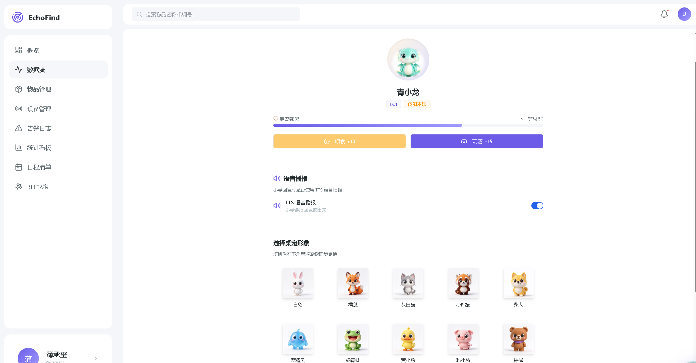

# AI+硬件 - EchoFind - 极致创科

EchoFind 是一个基于 ESP32 贴纸与飞书多维表格的智能寻物系统。本项目为其中控台代码，负责监控 ESP32 贴纸 → 飞书多维表格的整条数据传输链路，管理物品与设备，提供实时告警与统计看板。

## 项目简介

- **赛道**：AI+硬件
- **队伍**：极致创科
- **项目**：EchoFind 智能寻物系统

EchoFind 通过低功耗蓝牙贴纸（ESP32）绑定日常物品，利用信号强度实现室内定位与寻物引导。用户可通过手机端实时查看物品位置、信号强度与存放状态；中控台 Web 端提供设备管理、数据流监控、告警日志与统计看板，数据底座为飞书多维表格。

## 功能模块

- **概览 Dashboard**：数据总览、快捷操作、AI 今日推荐、待录入物品
- **数据流 Data Flow**：ESP32 → 飞书链路状态监控
- **物品管理 Items**：物品 CRUD、信号强度、存放状态
- **设备管理 Devices**：贴纸设备在线/离线/低电状态
- **告警日志 Alerts**：阻隔、低电、离线等异常告警
- **统计看板 Statistics**：数据可视化统计
- **设置 Settings**：飞书配置、AI 模型配置、基站配置

## 功能截图

**概览仪表盘** — 数据流健康状态、关键指标、在线率与最近上报一览


**物品管理** — 物品列表、信号强度、存放位置与贴纸绑定管理


**日程清单** — 日程日历与提醒必带物品，联动小寻智能提醒


**宠物乐园** — 桌宠养成与语音播报，提升寻物交互体验



## 技术栈

- **前端**：React 19 + TypeScript + Tailwind CSS + shadcn/ui + ReactECharts
- **后端**：NestJS 10 + Drizzle ORM + Postgres
- **数据底座**：飞书多维表格（物品信息表、日程表）
- **AI 能力**：AI 今日推荐、语音交互（基于大模型 API）

## 目录结构

```
├── client/                 # React 前端
│   ├── src/
│   │   ├── pages/          # 页面组件（Dashboard、数据流、物品管理等）
│   │   ├── components/     # 通用组件
│   │   └── api/            # 前端 API 封装
├── server/                 # NestJS 后端
│   ├── modules/
│   │   ├── items/          # 物品模块
│   │   ├── devices/        # 设备模块
│   │   ├── alerts/         # 告警模块
│   │   ├── stats/          # 统计模块
│   │   ├── settings/       # 设置模块
│   │   └── feishu/         # 飞书集成模块
│   └── database/           # 数据库 schema
├── shared/                 # 前后端共享类型定义
└── scripts/                # 构建与开发脚本
```

## 快速开始

```bash
# 安装依赖
npm install

# 启动开发环境（服务端 + 客户端）
npm run dev

# 构建生产版本
npm run build
```

### 环境变量配置

项目使用环境变量注入密钥，**不提交任何真实密钥到仓库**。运行前需配置：

| 变量 | 说明 |
|------|------|
| `FEISHU_APP_ID` | 飞书自建应用 App ID |
| `FEISHU_APP_SECRET` | 飞书自建应用 App Secret |
| `BITABLE_APP_TOKEN` | 飞书多维表格 App Token |
| `BITABLE_TABLE_ID` | 飞书多维表格 Table ID |
| `MODEL_API_KEY` | AI 模型 API Key（可选） |

## 硬件方案

- **贴纸端**：ESP32 低功耗蓝牙贴纸，周期性广播信号
- **基站**：室内部署基站接收信号强度，上报至服务端
- **定位**：基于 RSSI 信号强度的室内粗定位

## 声明

本仓库仅提交可公开的源码与配置模板，所有密钥、Token 等敏感信息均已脱敏，通过环境变量注入，请勿在公开仓库中提交真实凭据。
